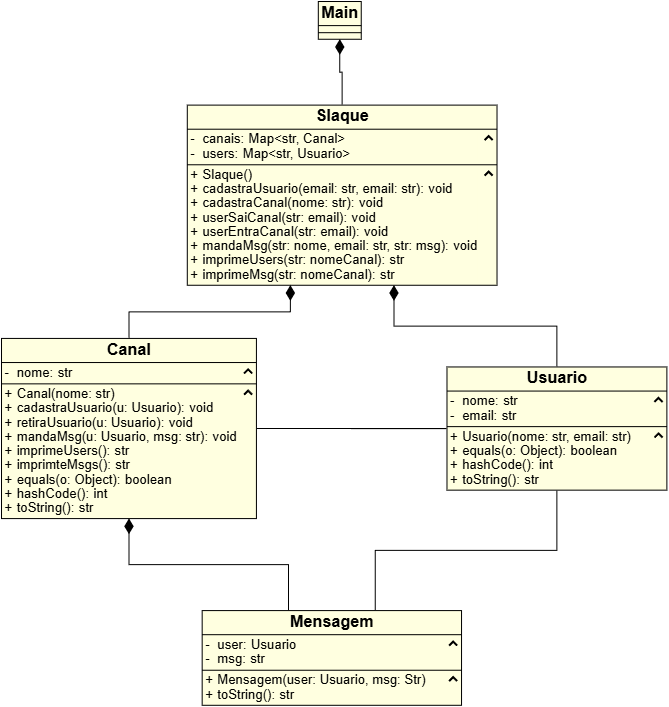

# Slaque

> Simulação simples de uma plataforma de mensagens, feita em Java.

## 📚 Sobre

Este projeto é um estudo que simula uma plataforma de troca de mensagens, com funcionalidades básicas como:

- Criação de usuários
- Criação de canais
- Envio de mensagens
- Armazenamento e exibição de mensagens por canal

⚠️ **Aviso:** Este projeto não está pronto para uso em produção e não trata todos os tipos de entrada ou erro.

---

## 🧠 Finalidade

Este projeto foi feito com fins educacionais, para praticar conceitos de:

- Orientação a Objetos
- Estrutura de pacotes em Java
- Manipulação de listas e classes personalizadas

---

## 👤 Autor

[Davi Vasconcelos](https://github.com/DaviVasconcelos07)

